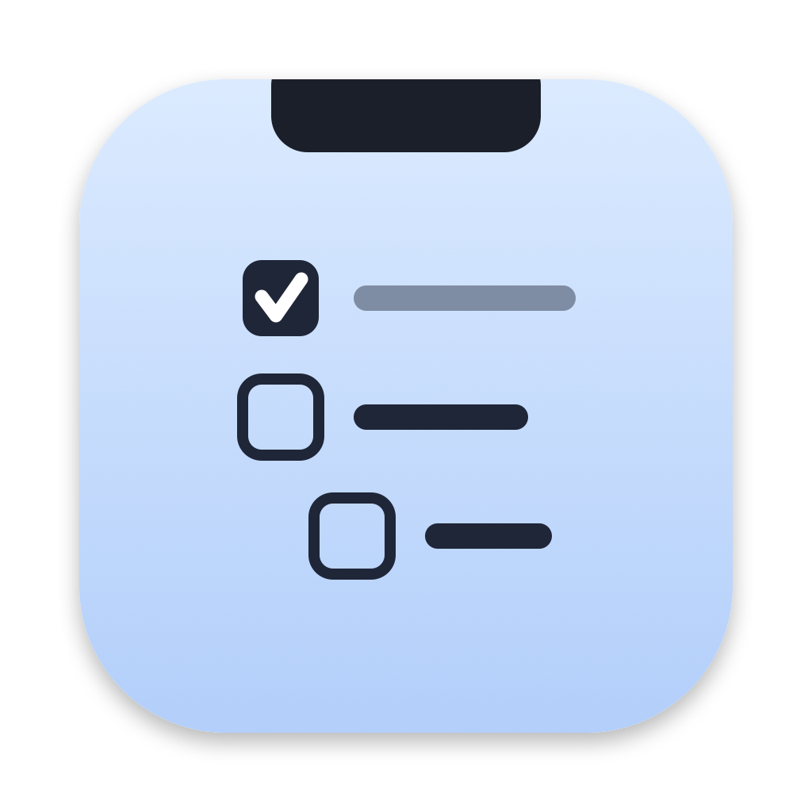

<p align="center"></p>

# TodoNotch

A small macOS menu bar app. Click the icon, or press **⌃⌥T**, and a todo list drops down from the notch.

- Checkbox list with nested sub-tasks.
- Checked tasks fade out after 2.5 seconds. Command-Z restores the most recent task.
- Collapsible sections. A collapsed section shows a badge with its count of open tasks.
- Sections with more open top-level todos appear first. Equal counts keep file order.
- Sections can mirror folders on disk. For example, one section for each project folder.
- The data is one plain text file. You can edit it in any editor, and the app picks up the changes.

## Install

You need macOS 14 or later and the Xcode Command Line Tools (`xcode-select --install`).

```sh
git clone https://github.com/maxiscoding28/todo-notch.git
cd todo-notch
make install
```

This builds `TodoNotch.app`, copies it to `/Applications`, and starts it.

To start it at login, enable **Open at login** in Settings.

If you download a release zip instead, macOS blocks the app because it is not notarized. Right-click the app, select **Open**, then confirm. Or run:

```sh
xattr -d com.apple.quarantine /Applications/TodoNotch.app
```

## Use

| Key | Action |
|---|---|
| ⌃⌥T | Open or close the panel |
| ↑ ↓ | Move to the previous or next task |
| Return | Add a task below |
| Tab / ⇧Tab | Nest or un-nest the task |
| ⇧⌘L | Switch the section layout |
| ⌘Z / ⇧⌘Z | Undo or redo text edits and task removal |
| ⌘A, then Delete | Clear the task. If it has sub-tasks, the app asks first |
| Delete on an empty task | Remove it |
| Esc | Close |
| ⌘, | Open Settings |

Click a section title to fold it. A section with no tasks stays folded. Click it to add the first task.

Right-click the menu bar icon for **Settings…**, **Open todo file**, and **Quit**.

If the menu bar is full, macOS can hide the icon behind the notch. Use ⌃⌥T instead.

## Settings

Open Settings with ⌘, while the panel is open, or right-click the menu bar icon. Settings sets two things:

- **Todo file**: the text file to use. The default is `~/todo.txt`. The app creates it if it does not exist.
- **Section layout**: show sections in one vertical list or in horizontal columns.
- **Open at login**: start TodoNotch when you sign in.
- **Sections from folders**:
  - **Contents of** a folder makes one section for each folder inside it.
  - **Folder** makes one section, named after that folder.

The window shows the sections you get before you apply. Removing a source never deletes tasks. Its sections stay as normal sections.

## File format

```
project-a
	Write the report
		- Collect numbers
		- [x] Draft intro
	[x] Send invoice

personal
	Book dentist
```

- A line with no indent is a section name.
- One tab starts a task. Two tabs and `- ` start a sub-task.
- `[x] ` marks a task as done.

## Build commands

| Command | Action |
|---|---|
| `make install` | Build, install to /Applications, and start |
| `make selftest` | Run isolated model and AppKit regression tests |
| `make dist` | Build `TodoNotch.zip` to share |
| `make icon` | Draw the icon again from `scripts/make-icon.swift` |

## License

MIT
